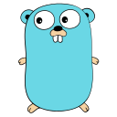
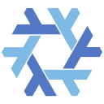

<h1 align="left" id="velstitle">:wave: Hello there! I'm Marvel</h1>

<p align="left">
  <a href="https://github.com/VeLLL3/VeLLL3"></a>
  <a href="https://jacobcolvin.com"></a>
  <a href="https://github.com/VeLLL3?tab=followers"></a>
</p>

<a href="#vels-title"></a>

- :office: &nbsp;I'm currently working at **[84.51°]**
- :seedling: &nbsp;I’m currently working on my **[homelab]**
- :speech_balloon: &nbsp;I like to talk about **K8s** and other **OSS**
- :book: &nbsp;Learn more about my projects on my **[blog]**
- :mailbox: &nbsp;Ask me anything on my **[issues page]**
- :computer: &nbsp;Connect with me on **[LinkedIn]**

<br>

<h2 align="left" id="vels-tech">Favorite Tech</h2>

> Tools, languages, and other things that I like to work with.

<table>
  <tr>
    <td align="center" width="96">
      <a href="#vels-tech"></a>
      <br>Go
    </td>
    <td align="center" width="96">
      <a href="#vels-tech"></a>
      <br>KCL
    </td>
    <td align="center" width="96">
      <a href="#vels-tech"></a>
      <br>TypeScript
    </td>
    <td align="center" width="96">
      <a href="#vels-tech"></a>
      <br>Kubernetes
    </td>
    <td align="center" width="96">
      <a href="#vels-tech"></a>
      <br>Dagger
    </td>
    <td align="center" width="96">
      <a href="#vels-tech"></a>
      <br>Nix
    </td>
    <td align="center" width="96">
      <a href="#vels-tech"></a>
      <br>tmux
    </td>
    <td align="center" width="96">
      <a href="#vels-tech"></a>
      <br>nvim
    </td>
  </tr>
</table>

<h2 align="left">Coding Activity</h2>

> Total logged open-source coding time since 2020-07-19. Updated every 1 hour.

<!-- prettier-ignore-start -->
<!-- START_SECTION:ascii_graph -->

```
  2204.6 hr  ┤╭────────────────────────────────────────────────────────────────────────────────────────────────── 
  2204.6 hr  ┤│                                                                                                   
  2204.6 hr  ┤│                                                                                                   
  2204.6 hr  ┤│                                                                                                   
  2204.6 hr  ┤│                                                                                                   
  2204.5 hr  ┤│                                                                                                   
  2204.5 hr  ┤│                                                                                                   
  2204.5 hr  ┤│                                                                                                   
  2204.5 hr  ┤│                                                                                                   
  2204.5 hr  ┤│                                                                                                   
  2204.5 hr  ┤│                                                                                                   
  2204.4 hr  ┤│                                                                                                   
  2204.4 hr  ┼╯                                                                                                   
             ┼─────────────┬─────────────┬─────────────┬─────────────┬─────────────┬─────────────┬─────────────┤ 
            -7d           -6d           -5d           -4d           -3d           -2d           -1d           now
```

<!-- END_SECTION:ascii_graph -->
<!-- prettier-ignore-end -->

<!-- links -->
<p align="center">
  <a href="https://linkedin.com/in/stefani-gifta-ganda">
    
  </a>
  <a href="https://codepen.io/stefanigifta">
    
  </a>
  <a href="https://instagram.com/stefanigifta">
    
  </a>
  <a href="mailto:stefanigiftaganda@gmail.com">
    
  </a>
</p>
