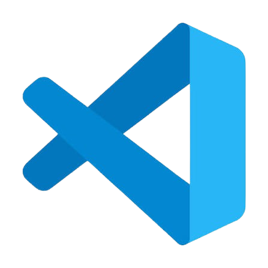
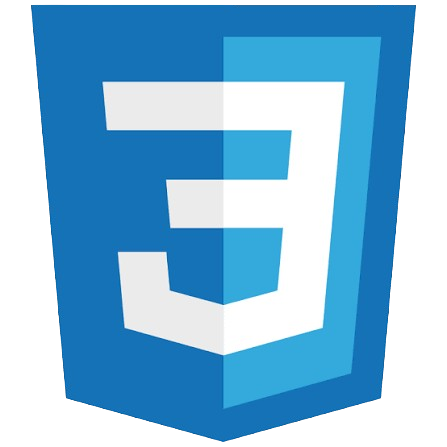
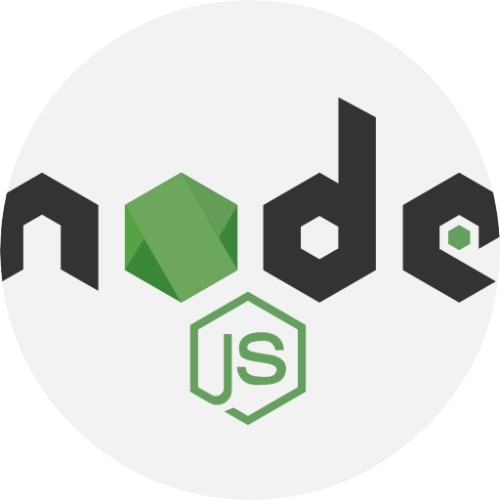
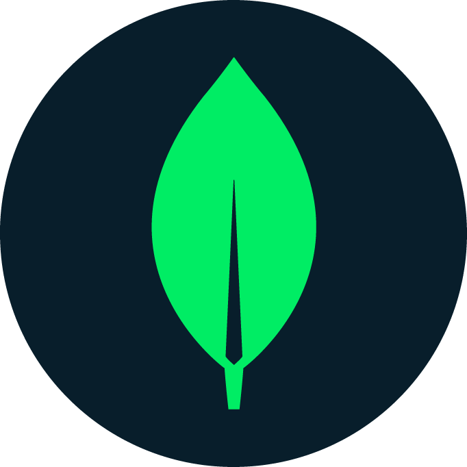
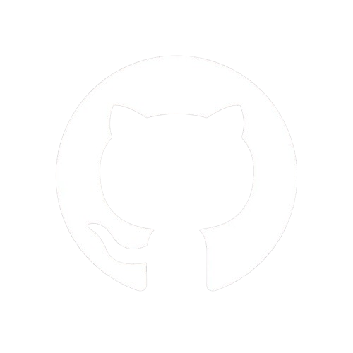

<h1 align="left" id="velstitle"> Hello there! I'm Marvel</h1>

  
  
  
  
  
  

- 💻 &nbsp;I'm currently working on something cool 😉
- 🌱 &nbsp;I’m currently learning HTML, Javascript, CSS
- 🚀 &nbsp;Building projects and bringing ideas to life
- 🔭 &nbsp;Exploring new technologies and challenging myself
- 💡 &nbsp;Fun fact: I rarely leave an idea as just an idea

 

<h2 align="left" id="vels-tech">Languages and Tools</h2>

   <b>Visual Studio Code</b>
  &nbsp;&nbsp;
   <b>HTML5</b>
  &nbsp;&nbsp;
   <b>CSS3</b>
  &nbsp;&nbsp;
   <b>JavaScript</b>
  &nbsp;&nbsp;
   <b>Node.js</b>
  &nbsp;&nbsp;
   <b>MongoDB</b>
  &nbsp;&nbsp;
   <b>GitHub</b>

<h2 align="left" id="vels-tech">Recent GitHub Activity</h2>

> Automatically updated every 5 minute.

<!--RECENT_ACTIVITY:start-->
1. ⬆️ Pushed to [xoxovell/Personal-Portfolio](https://github.com/xoxovell/Personal-Portfolio) 
2. ⬆️ Pushed to [xoxovell/Personal-Portfolio](https://github.com/xoxovell/Personal-Portfolio) 
3. ⬆️ Pushed to [xoxovell/Personal-Portfolio](https://github.com/xoxovell/Personal-Portfolio) 
4. ⬆️ Pushed to [xoxovell/Personal-Portfolio](https://github.com/xoxovell/Personal-Portfolio) 
5. ⬆️ Pushed to [xoxovell/Personal-Portfolio](https://github.com/xoxovell/Personal-Portfolio) 
<!--RECENT_ACTIVITY:end-->

